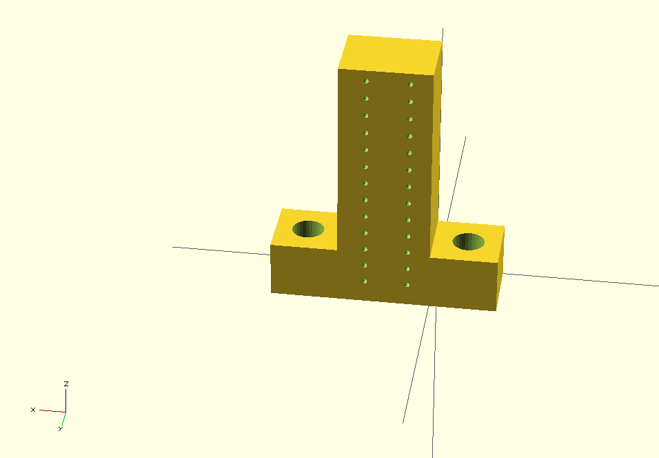

Commutator Connection Arm Block
===============================

3D printed part to hold wire arms for small animal slip ring commutator. Variable number of channels, default is 12.

Created with [OpenScad](http://www.openscad.org/).

